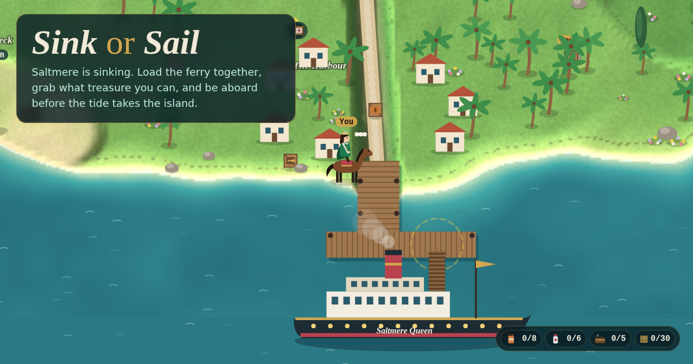

# The Last Ferry

Saltmere is sinking. One grand old ferry waits at the harbour. Fill its hold with fuel, medicine and tools, and sail before the tide takes the island. Carry off whatever treasure you can fit.

A live multiplayer browser game for 1 to 8 players. One person starts a room, everyone else joins with the 4-letter code or the link, from any phone or laptop. No accounts, no installs. Bots fill empty seats. A game lasts five tides, about 15 minutes (or about 8 in quick mode).



## How to play

- **Walk anywhere.** WASD or the arrow keys, or click where to go. On a phone, drag anywhere to steer or tap a spot. Saddle a horse at the Royal Stables to ride much faster.
- **Carry crates to the ferry.** Walk into glowing crates to pick them up (you carry 3) and walk onto the gangway by the ferry to load them. The brass gauges show what the crossing still needs: 8 fuel, 6 medicine and 5 tools in a full game (4, 3 and 2 in a quick one). Spares you load earn a pearl each.
- **The tide takes the island.** Every three minutes the sea rises and drowns the next band of land, with any crates left on it. Dotted tide marks on the ground show where the water will reach. About ten crates wash up each tide in three waves (at the start, a third and two thirds of the way through), along with two diamonds and fresh pearls; the tide card counts down to the next wave. Scroll, pinch or use the zoom buttons to see more of the island, and the map marks every crate and pearl you've spotted.
- **Treasure and secrets.** Diamonds you load are yours if the ferry makes it. Dive at the Turquoise Coves for pearls and barter them at the Pearl Market. Light the lighthouse to reveal every crate and a hidden stepping-stone path. The compass in the palace opens the sealed Sapphire Caves.
- **All aboard.** Stand on the pier and tap Ready. When most players are ready, the ferry sails in 15 seconds; after the last tide it sails anyway. Anyone not on the pier is left behind. The richest Islander aboard is crowned Grand Fortune.
- **The cutlass.** About one crate a tide holds a cutlass. Strike someone next to you and they're knocked out for 15 seconds and drop everything they carry. It breaks after one hit, and the victim is safe for 10 seconds after getting up.
- **Secret Wrecker.** With 5 or more players (or switched on in the lobby), a hidden player can sink crates at the gangway. Anyone can accuse once; a majority vote locks the accused in the brig.

Six characters, one power each: the Pearl Diver (double pearls from dives), the Engineer (carries 4), the Physician (sees all medicine on the map), the Cartographer (starts on the fastest horse), the Jeweler (the merchant and bots always accept), and the Duchess (starts mounted, finds a bonus pearl in every crate).

Talk with the walkie-talkie: hold it (or hold V) to speak, with a mute button beside it, talking rings over each speaker and per-player volume. One-tap signals and text chat show as speech bubbles over your character.

## Running it

```bash
npm install
npm run dev      # game server on :3000, client with hot reload on :5173
npm test         # rules engine tests
npm run build && npm start   # production build served from :3000
```

## How it's built

- `shared/world.ts` describes the island: terrain heights, places, the tide schedule, walking and path finding.
- `shared/game.ts` is the rules engine. The server runs it ten times a second, checks every move, and sends each player a view with hidden information removed.
- `shared/bots.ts` contains the bots, which walk the island with the same rules as people.
- `server/` is a Node server (Express and Socket.IO) that runs rooms, streams positions and relays voice signalling.
- `client/` is a React app. The island is painted on a canvas (`client/src/scene.ts`, `client/src/World.tsx`); everything is drawn in code, with no image assets.
- Voice chat is peer-to-peer WebRTC audio. Public STUN works for most networks. For strict networks, set `TURN_URL`, `TURN_USERNAME` and `TURN_CREDENTIAL` to add a TURN relay.

## Deploying

The repo includes a `render.yaml`. On [Render](https://render.com), choose **New → Blueprint**, pick this repository, and deploy. Any host that runs a long-lived Node process with WebSockets works: build with `npm run build`, start with `npm start`, and the app listens on `$PORT`.
